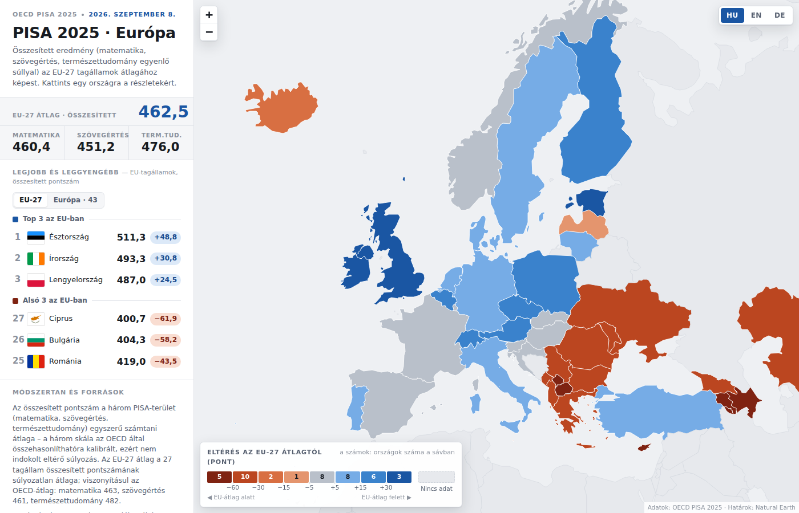

# PISA 2025 · Európa-térkép

Interaktív térkép az OECD **PISA 2025** eredményeiről (megjelent: 2026. szeptember 8.). **Európa 43 résztvevője és a világ mind a 90 résztvevője** (Európa / Világ nézetváltó) **összesített pontszámmal** (matematika, szövegértés, természettudomány egyenlő súllyal) egy **váltható viszonyítási alaphoz** képest (EU‑27 átlag · Európa‑43 átlag · OECD‑átlag), országonkénti részletekkel, **51 régiós ponttal** (OECD B2 melléklet), **világ‑blokk összevetéssel és 2012–2025 trenddel**, Top 3 / Alsó 3 widgettel (EU‑27 / Európa / Világ), magyar / angol / német felülettel.

**Élő térkép (GitHub Pages):** https://mrolah.github.io/pisa-2025-europa-map/

*(English summary at the end.)*



## Mit mutat a térkép?

- **Színezés:** eltérés az EU‑27 súlyozatlan átlagától (2025-ben 462,5 pont), 8 osztályban: ≥ +30 · +15…+30 · +5…+15 · ±5 · −5…−15 · −15…−30 · −30…−60 · < −60, plus „nincs adat". Diverging kék (átlag felett) / narancs‑vörös (átlag alatt) skála, semleges szürke középpel; a színlépcsők világos és sötét témára is ellenőrzöttek.
- **Popup** minden országnál: összesített pontszám, eltérés az EU‑átlagtól, EU‑ és európai rangsor, a három terület pontszáma, Δ az EU‑átlaghoz és Δ 2022‑höz (az OECD hivatalos értéke), adatminőségi megjegyzések.
- **Top 3 / Alsó 3 widget:** alapból az EU‑27 tagállamok, váltóval mind a 43 résztvevő (ekkor pl. az Egyesült Királyság a 2.).
- **Európa / Világ nézet:** a bal felső váltóval a térkép kizoomol, és mind a 90 PISA‑résztvevő színezve látszik (Uzbegisztán csak természettudományból közölt adatot, ezért nem szerepel). A poligon nélküli egységek — B‑S‑J‑Z (4 kínai tartomány), Hongkong, Makaó, Szingapúr, Mauritius, Dusanbe, Kurdisztán régió — pontként, a popupban külön jelölve.
- **Viszonyítási alap váltó** a legendben (EU‑27 / Európa‑43 / OECD): a színezés, a popupok és a widget eltérései átszámolódnak.
- **Régiók:** 51 országon belüli egység (Belgium közösségei, Spanyolország autonóm közösségei, Olaszország makrorégiói, az Egyesült Királyság országrészei, Kazahsztán régiói, Baku) pontként, saját popuppal és az országos értékhez viszonyított eltéréssel. A PISA iskolai szintű adatai anonimizáltak és helymegjelölés nélküliek, ezért a régió a legfinomabb térképezhető szint.
- **Világ‑összevetés** az oldalsávban: blokkátlagok (Kelet‑Ázsia 6, USA, angolszász országok, OECD, EU‑27, Európa‑43, Délkelet‑Ázsia, Közel‑Kelet, Latin‑Amerika, Közép‑Ázsia, Afrika) és a 2012–2025 trend állandó országkörön.
- **Legend és nyelvváltó** a térképen; a kezdeti nézet az EU‑27‑re illeszkedik; világos/sötét téma a rendszerbeállítás szerint.

## Módszertan

- **Összesített pontszám** = a három PISA‑terület egyszerű számtani átlaga. Az OECD a három skálát összehasonlíthatóra kalibrálja, ezért eltérő súlyozás nem indokolt.
- **EU‑27 átlag** = a 27 tagállam összesített pontszámának súlyozatlan átlaga (ugyanaz a logika, mint az OECD‑átlagnál). 2025: matematika 460,4 · szövegértés 451,2 · természettudomány 476,0 · összesített **462,5**. Viszonyításul az OECD‑átlag: 463 · 461 · 482.
- A színosztályok sorrendet mutatnak; néhány pontos különbség statisztikailag nem feltétlenül szignifikáns. A `*` jelű országoknál (Hollandia, Norvégia, Albánia) az OECD szerint egy vagy több mintavételi szabvány nem teljesült.
- **2022→2025 változás:** az OECD I.1 táblázatának hivatalos „short-term change" értéke, nem a 2022‑es átlagokból számolva (Albániánál az OECD nem közöl összevetést; Luxemburg és Örményország 2022‑ben nem vett részt; Azerbajdzsánból 2022‑ben csak Baku; Ukrajna: 27‑ből 17 régió).

## Források és licencek

| Mi | Forrás | Licenc |
|---|---|---|
| PISA 2025 pontszámok és 2022→2025 változás | OECD, *PISA 2025 Results (Volume I)*, Table I.1 (2026‑09‑08) — [oecd.org](https://www.oecd.org/en/publications/pisa-2025-results-volume-i_73451bc5-en.html) | OECD adatfelhasználási feltételek, forrásmegjelöléssel |
| PISA 2022 referenciaértékek | OECD, *PISA 2022 Results (Volume I)* | — |
| Országhatárok | [Natural Earth](https://www.naturalearthdata.com/) 1:50m, admin‑0 (a Krím Ukrajna, Észak‑Ciprus Ciprus részeként) | public domain |
| Zászlók | [flag-icons](https://github.com/lipis/flag-icons) | MIT |
| Térképmotor | [Leaflet](https://leafletjs.com/) 1.9.4 (CSS beágyazva, JS cdnjs‑ről) | BSD‑2 (`data/LEAFLET-LICENSE`) |
| Betűk | IBM Plex Sans / Plex Sans Condensed (Google Fonts) | OFL |
| Ez a kód | [MIT](LICENSE) | |

## A repó felépítése

```
docs/index.html        kész, önálló oldal (GitHub Pages ezt szolgálja ki) – minden adat beágyazva
docs/preview.png       képernyőkép a README-hez
dist/artifact.html     ugyanez <html>/<head>/<body> nélkül – Claude‑artifactként való újrapublikáláshoz
src/template.html      az oldal forrása (HTML + CSS + JS, i18n szótárral); a __PLACEHOLDER__‑eket a build tölti ki
src/pisa_data.py       a 43 európai résztvevő (nevek 3 nyelven, 2025 és 2022 pontszámok, megjegyzések)
src/world_data.py      a további 47 résztvevő (nevek 3 nyelven, pont‑egységek koordinátái); pontszámok a world táblából
src/blocs.py, src/history.py  blokkátlagok és trend számítása (data/blocs_raw.json)
src/build_page.py      összeállítja docs/index.html és dist/artifact.html fájlt   ← ezt kell futtatni
src/build_geo.py       (opcionális) Natural Earth → data/world.geojson újragenerálása
src/make_flags.py      (opcionális) flag-icons → data/flags.json újragenerálása
data/oecd_table_i1.json  OECD I.1 tábla: pontszámok + hivatalos 2022→2025 változás (a build ellenőrzi az egyezést)
data/oecd_table_i1_world.txt  a teljes I.1 tábla (91 résztvevő + OECD‑átlag) a blokkátlagokhoz
data/blocs.json        blokkátlagok és 2012–2025 trend (src/blocs.py + src/history.py állítja elő)
data/regions.json      51 régió pontszámai (OECD B2 melléklet, I.B2.1–3 táblák) + horgonypontok
data/world.geojson     határok az egész világra (Európa 30%, a többi 10% egyszerűsítés, országonként egyesítve), előszámolt szárazföldi bbox + horgonypont
data/flags.json        zászlók data‑URI‑ként
data/leaflet.css       Leaflet 1.9.4 CSS (beágyazásra)
```

## Építés

Csak a Python standard könyvtár kell:

```bash
python src/build_page.py
```

Ez frissíti a `docs/index.html` és `dist/artifact.html` fájlt. Adatmódosításhoz a `src/pisa_data.py` **és** a `data/oecd_table_i1.json` fájlt is át kell írni (a build szándékosan hibát dob, ha a kettő eltér). Szöveg, színek, osztályhatárok: `src/template.html` (`I18N` szótár, `:root` tokenek, `classOf()`).

Határok vagy zászlók újragenerálása (ritkán kell):

```bash
pip install shapely playwright && playwright install chromium
npm install flag-icons mapshaper
python src/build_geo.py      # Natural Earth letöltés, Krím/Ciprus korrekció, kétszintű egyszerűsítés
python src/make_flags.py     # zászlók data‑URI‑ba
python src/build_page.py
```

## Publikálás GitHub Pages‑re

1. A repó **Settings → Pages** oldalán: *Source: Deploy from a branch*, *Branch: `main`*, *Folder: `/docs`*, majd *Save*.
2. 1–2 perc múlva az oldal él a `https://mrolah.github.io/pisa-2025-europa-map/` címen; minden `docs/index.html`‑t érintő push automatikusan frissíti.

---

## English summary

Interactive Leaflet map of the OECD **PISA 2025** results (released 8 September 2026) — 43 European participants in the home view, all 90 participants in the World view. Countries are coloured by their **composite score** (mean of mathematics, reading and science) relative to a **switchable baseline** — the unweighted EU‑27 average (462.5 in 2025), the Europe‑43 average (447.9) or the OECD average (468.7); each popup shows the three domain scores, the gap to the baseline, the OECD's official change since 2022, and EU / Europe rank. **51 sub‑national regions** (OECD Annex B2) are shown as points, and a side panel puts the EU in **global context** (bloc averages and a 2012–2025 trend on a constant country set). Top 3 / bottom 3 widget (EU‑27 or all participants), legend and HU/EN/DE switcher on the map, light and dark themes.

Build with `python src/build_page.py` (standard library only); `docs/index.html` is the standalone page served by GitHub Pages. Data: OECD PISA 2025 Results Vol. I, Table I.1; boundaries: Natural Earth (public domain); flags: flag‑icons (MIT); map engine: Leaflet (BSD‑2). Code: MIT.
